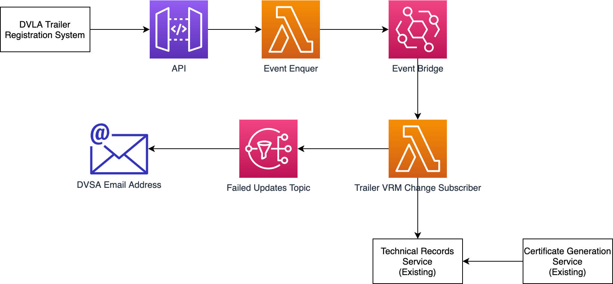
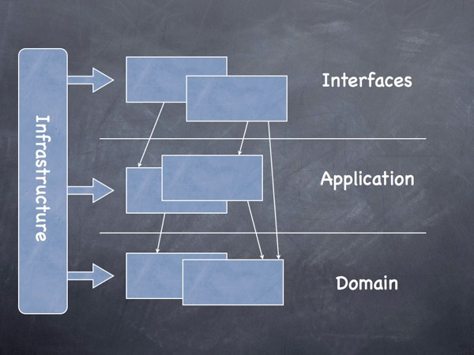

# cvs-svc-trailer-registration

A service to allow Trailer owners to apply for a registration mark for their trailer from DVLA. This will deliver the capability for DVSA to receive VRM so that that can be printed on trailer MOT where it is available.

## Architecture

The Target architecture will see DVSA receive trailer information and update this onto the vehicles Technical Record. This is via an asynchronous event pattern. i.e. the message is received from DVLA and acknowledged, and then asynchronously processed into CVS.



## Dependencies

The project runs on node 12.x with typescript and serverless framework. For further details about project dependencies, please refer to the `package.json` file.

## Running the project

Once the dependencies are installed, you will be required to rename the `/config/env.example` file to `.env.local` as we use dotenv files for configuration. Further information about [variables](https://www.serverless.com/framework/docs/providers/aws/guide/variables/) and [environment variables](https://www.serverless.com/framework/docs/environment-variables/) with serverless.

The application runs on port `:3001` by default when no stage is provided.

### Environments

We use `NODE_ENV` environment variable to set multi-stage builds with the help of dotenv through npm scripts to load the relevant `.env.<NODE_ENV>` file from `./config` folder into the `serverless.yml` file as we don't rely on serverless for deployment.

The following values can be provided:

```ts
'local'; // used for local development
'development'; // used development staging should we wish to require external services
'test'; // used during test scripts where local services, mocks can be used in conjonction
```

```ts
/** Running serverless offline as an example for a specific stage - 'local'.
* Stage 'local' will be injected in the serverless.yml
**/
NODE_ENV=local serverless offline

```

Please note that if no `NODE_ENV` variable is provided, it will default to `'development'` environment and use default values in the `serverless.yml` file.

Further details about environment setup can be found in the provided documentation and `env.example` file.

All secrets the secrets are will stored in `AWS Secrets Manager`.

### Scripts

The following scripts are available, for further information please refer to the project `package.json` file:

- <b>start</b>: `npm start` - _launch serverless offline service_
- <b>dev</b>: `npm run dev` - _run in parallel the service and unit tests in_ `--watch` _mode with live reload_.
- <b>test</b>: `npm t` - _execute the unit test suite_
- <b>build</b>: `npm run build` - _bundle the project for production_

### Offline

Serverless-offline with webpack is used to run the project locally. Please use `npm run dev` script to do so.

### Lambda locally

Serverless can invoke lambda functions locally which provide a close experience to the real service if you decide not use the offline mode. `events` and `paths` can be found under `/local` folder.
For further details using lambda locally please refer to the [serverless documentation](https://www.serverless.com/framework/docs/providers/aws/cli-reference/invoke-local/).

### Debugging

Existing configuration to debug the running service has been made available for vscode, please refer to `.vscode/launch.json` file. Serverless offline will be available on port `:4000`. 2 jest configurations are also provided which will allow to run a test or multiple tests.

For further information about debugging, please refer to the following documentation:

- [Run-a-function-locally-on-source-changes](https://github.com/serverless-heaven/serverless-webpack#run-a-function-locally-on-source-changes)

- [VSCode debugging](https://github.com/serverless-heaven/serverless-webpack#vscode-debugging)

- [Debug process section](https://www.serverless.com/plugins/serverless-offline#usage-with-webpack)

## Testing

Jest is used for unit testing.
Please refer to the [Jest documentation](https://jestjs.io/docs/en/getting-started) for further details.

[json-serverless](https://github.com/pharindoko/json-serverless) has been added to the repository should we wish to mock external services during development.

## Infrastructure

<Insert Design>

### Release

To be added - semantic-release

## Contributing

### External dependencies

The projects has multiple hooks configured using [husky](https://github.com/typicode/husky#readme) which will execute the following scripts: `audit`, `lint`, `build`, `test` and format your code with [eslint](https://github.com/typescript-eslint/typescript-eslint#readme) and [prettier](https://github.com/prettier/prettier).

You will be required to install [git-secrets](https://github.com/awslabs/git-secrets) (_brew approach is recommended_) and DVSA [repo-security-scanner](https://github.com/UKHomeOffice/repo-security-scanner) that runs against your git log history to find accidentally committed passwords, private keys.

We follow the [conventional commit format](https://www.conventionalcommits.org/en/v1.0.0/) when we commit code to the repository and follow the [angular convention](https://github.com/conventional-changelog/commitlint/tree/master/%40commitlint/config-conventional#type-enum).

The type is mandatory and must be all uppercase.
The scope of your commit remain optional however if adding it, it must include your ticket number and be all uppercase or it will throw a warning.

```js
// Please see /commitlint.config.js for customised format

TYPE(SCOPE?): subject

// examples
'CHORE(CVSB-1234): my commit msg' // pass
'CHORE(cvsb-1234): my commit msg' // fail

```

### Code standards

The code uses [eslint](https://eslint.org/docs/user-guide/getting-started), [typescript clean code standards](https://github.com/labs42io/clean-code-typescript) as well as sonarqube for static analysis.
SonarQube is available locally, please follow the instructions below if you wish to run the service locally (brew is the preferred approach):

- _Brew_:

  - Install sonarqube using brew
  - Change `sonar.host.url` to point to localhost, by default, sonar runs on `http://localhost:9000`
  - run the sonar server `sonar start`, then perform your analysis `npm run sonar-scanner`

- _Manual_:
  - Add sonar-scanner in environment variables in your \_profile file add the line: `export PATH=<PATH_TO_SONAR_SCANNER>/sonar-scanner-3.3.0.1492-macosx/bin:$PATH`
  - Start the SonarQube server: `cd <PATH_TO_SONARQUBE_SERVER>/bin/macosx-universal-64 ./sonar.sh start`
  - In the microservice folder run the command: `npm run sonar-scanner`

Domain Drive Design diagram with Interfaces, Application, Domain layers and Infrastructure across the layers

.

Further reading: [E. Evans in its Domain Driven Design approach](http://dddsample.sourceforge.net/architecture.html) and [The Clean Architecture](https://blog.cleancoder.com/uncle-bob/2012/08/13/the-clean-architecture.html).
